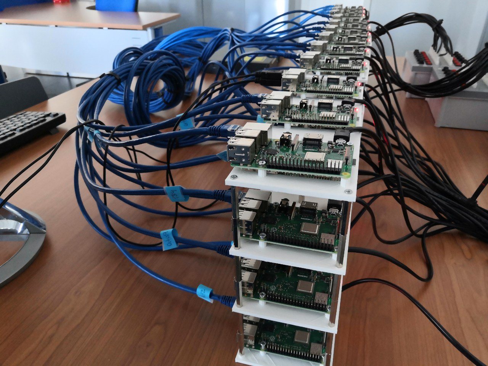
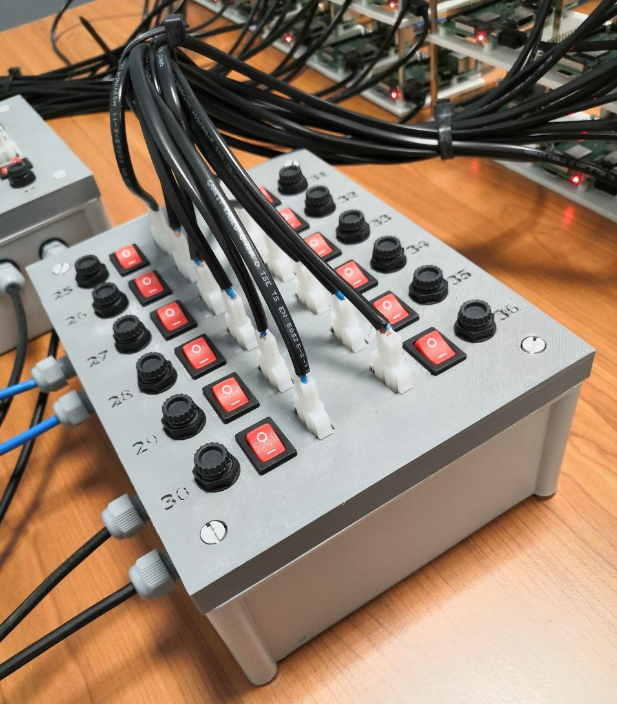
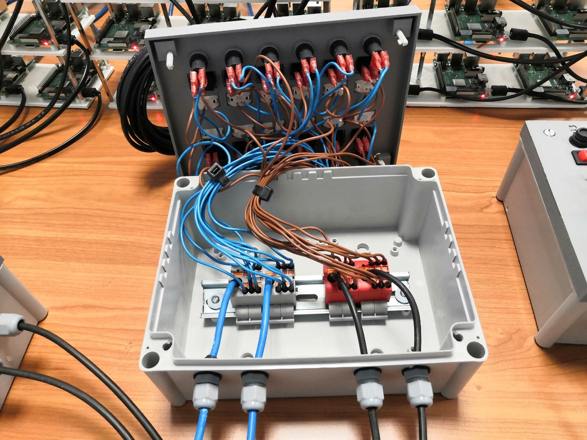

# FogPi Cluster

The FogPi is an embedded, portable, low-cost and low-power consumption (compared with tradicional Fog servers) Fog computing infrastructure composed by a cluster of 48 Raspberry Pis model 3 B+. FogPi can run Dockers containers and services which are managed and orchestrated through Docker Swarm. The software and hardware components used are accessible and are listed below. 3D cases and bases have been designed for FogPi and are available in this [3D_Designs](https://github.com/ertis-research/rpi-cluster/tree/master/3D_Designs). You can also see the whole deployed infrastructure at xmas time [here](https://raw.githubusercontent.com/ertis-research/rpi-cluster/master/photos/rpi-cluster.jpg). 

 FogPi is specially suitable for environments where the limited Internet connection and reduced budgets limit the adoption of Fog and Edge deployments.

## Software Components
FogPi uses the open-source projects listed below:

- [Hypriot](https://blog.hypriot.com/) Operating system
- [Docker](https://www.docker.com/) containers
- [Docker Swarm](https://docs.docker.com/engine/swarm/) for cluster management, orchestation, scaling and load balancing
- [Portainer](https://www.portainer.io/) Community Edition for managing the Swarm clusters and their Docker resources (containers, images, volumes, networks and more)
- [Docker Swarm Visualizer](https://github.com/dockersamples/docker-swarm-visualizer) for visualising the nodes belonging to the Swarm cluster and the containers deployed on them
- [Flash](https://github.com/hypriot/flash) for flashing Hypriot images into SD cards fast. An example of configuration file for the OS can be found in the cluster.yml file

## Hardware Components

The cluster layers include the components used in all the layers of the FogPi infrastructure. The Power connection include the components used to power and control the power in the Raspberry Pis.

### Cluster layers
- 48x [Raspberry Pi 3 Model B+](https://es.rs-online.com/web/p/kits-de-desarrollo-de-procesador-y-microcontrolador/1373331/)
- 48x [Samsung 64Gb Micro SD Card EVO Plus](https://es.rs-online.com/web/p/tarjetas-micro-sd/1449018/)
- 48x [Ethernet RJ45 cable Cat 6 2m](https://es.rs-online.com/web/p/cables-cat6/0557278/)
- 1x [Switch Cisco Catalyst 2960 10/100 48 ports](https://www.cisco.com/c/en/us/products/collateral/switches/catalyst-2960-plus-series-switches/data_sheet_c78-728003.html)
- 2x [50 hexagonal brass threaded spacer](https://es.rs-online.com/web/p/separadores-hexagonales/1058268)
- 1x [500 Metric thread screw DIN 965 M3 X 10 MM](https://www.bricomart.es/tornillo-rosca-metrica-din-965-3-x-10-mm-500-uds.html)
- 1x [500 Metric thread screw DIN 965 M3 X 20 MM](https://www.bricomart.es/tornillo-rosca-metrica-din-965-3-x-20-mm-500-uds.html)

### Power connection

We have designed 4 power connection units through 3D designs where 12 Raspberry Pis can be connected. Each box includes unique ID numbers to identify each Raspberry; a EconoLatch Plug Housing connector to power via a micro-USB cable with EconoLatch Receptacle Housing connector the Raspberry; a fuseholder with its corresponding fuse to protect the Raspberry from power issues; and illuminated  LED switch to switch off and on the Raspberries individually when required. Inside each box all the components are connected through Power Distribution and Phoenix terminals to the power supply.

- 1x [600W 5V Power supply with PFC Function](https://es.rs-online.com/web/p/fuentes-de-alimentacion-de-modo-conmutado-smps-integradas/7059793/)
 - 4x [Electric Box 216x166x90 J200L](http://www.gsv.be/products/~box-line-cable-junction-box-494.htm?lng=en)
- 1x [100m power cable 18 AWG](https://es.rs-online.com/web/p/cables-de-alimentacion/7756072/)
- 48x [Adafruit USB DIY Connector Shell Micro-B Plug](https://www.mouser.de/ProductDetail/Adafruit/1390?qs=%2Fha2pyFaduhFuWEsUKeUbf2QWx0K1NN62MpBwGEmOkw%3D)
- 96x [EconoLatch Fem Connector 16-18AWG](https://eu.mouser.com/ProductDetail/Molex/150181-1016?qs=%2Fha2pyFaduiz%2FN24ZbFx6dA3HgpY4HrnC%2FORFUOYP1D%252BZB6m%2F2si8Q==)
- 96x [EconoLatch Male Connector 16-18AWG](https://eu.mouser.com/ProductDetail/Molex/150180-1016?qs=%2Fha2pyFaduiz%2FN24ZbFx6YplJVzN7IuX3d5NaFm%252BWL29XzZysfk85w%3D%3D)
- 2x [100 Terminals RCPT 22-18 6.35x0.81 Cut Strip](https://eu.mouser.com/ProductDetail/TE-Connectivity-AMP/2-520183-2-Cut-Strip?qs=%2Fha2pyFaduj%2FbPX00OfTPGaZVDD0LLUJxr6bt38hNHHLPCI4BQlFiw%3D%3D)
- 8x [Power Distribution Block DIN Rail PTFIX 6/6X2 for GND](https://eu.mouser.com/ProductDetail/Phoenix-Contact/3273202?qs=%2Fha2pyFaduhSzK3XeljgRAlZ7sIBSkknlZsVt%2F8l7d8%3D)
- 8x [Power Distribution Block DIN Rail PTFIX 6/6X2 for VCC](https://eu.mouser.com/ProductDetail/Phoenix-Contact/3273198?qs=%2Fha2pyFadujtpQiZt4J16NQ3nxBg5Eu35s5sV%252BcxrC8%3D)
- 8x [Phoenix Terminals AI6-12GN for GND](https://eu.mouser.com/ProductDetail/Phoenix-Contact/3201107?qs=sGAEpiMZZMvlX3nhDDO4AHqKST%252BUHUuOUUIO4tc582A%3D)
- 8x [Phoenix Terminals AI6-12GN for VCC](https://eu.mouser.com/ProductDetail/Phoenix-Contact/3200108?qs=sGAEpiMZZMvlX3nhDDO4AJrpUq5MrAz%2Fg75%252Bmyey55g%3D)
- 1x [100 Phoenix Terminals AI 1,0-8 RD S1](https://eu.mouser.com/ProductDetail/Phoenix-Contact/1200106?qs=sGAEpiMZZMvi6wO7nhr1L9%252BR1lKe9QPN475qQFpaSbA%3D)
- 1x [4m power black cable 10mm2 for GND](https://www.bricomart.es/hilo-flexible-h07z1-k-10mm2-negro-metro-lineal.html)
- 1x [4m power blue cable 10mm2 for VCC](https://www.bricomart.es/hilo-flexible-h07z1-k-10mm2-azul-metro-lineal.html)
- 1x [2m DIN rail](https://www.bricomart.es/carril-din-2-m.html)
- 16x [Ring connectors](https://www.digikey.es/product-detail/es/te-connectivity-amp-connectors/2-36161-2/A27284TR-ND/289202)
- 48x [Illuminated LED Rocker Switch](https://es.rs-online.com/web/p/products/0419750/)
- 48x [Shock-Safe Fuseholder, 5x20 mm](https://docs.rs-online.com/0b57/0900766b8138bb09.pdf)
- 100x [Ceramic Fuse 5x20mm](https://es.rs-online.com/web/p/products/7897808/)
- 48x [EconoLatch Receptacle connector, Single Row, 2 Circuits](https://es.rs-online.com/web/p/products/1365645/)
- 48x [EconoLatch Plug connector, Single Row, with Panel Mount Latch, 2 Circuits](https://es.rs-online.com/web/p/products/1365644/)

The photo below shows one of the power distribution units of FogPi. Each Raspberry is identified with its number, can be switched off and on with the rocker switches, and fuses protect them from power issues. The Raspberries are powered through their micro-USB inputs with a fabricated 18AWG power cable (this cable is the minimum required for powering the Raspberries), which contains a Micro-B Plug connector, and an EconoLatch Plug to connect them to the EconoLatch Receptacle connector installed in the power units.

This is how the power units are inside. VCC and GND are connected in a circuit from the components in the power units to the Phoenix power distribution blocks with push-in connections. Finally, Phoenix power distribution blocks are connected through 7AWG cables to the power supply.

## Acknowledgment
This infrastructure has been financiated with public funding from Spanish research projects at the [ERTIS Research Group](http://ertis.uma.es/), [University of Malaga](https://www.uma.es/), Spain.